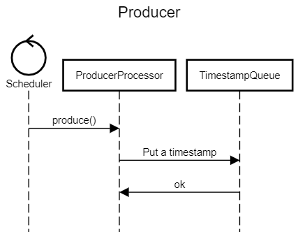
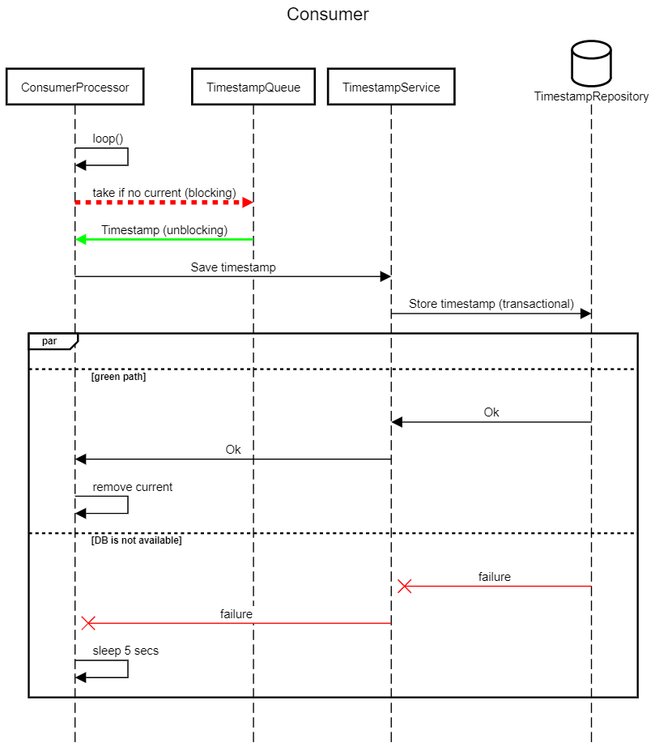
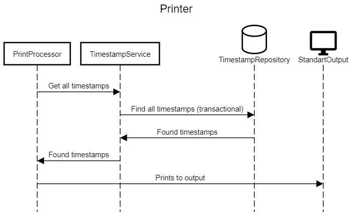

# Queue Time Stamper

## Requirements

### Create a Java console application with the following functions:
1. When launched without parameters, the application starts to write a metrics message to a database every one second. The message must contain the current timestamp and any string body.
2. When launched with the -p parameter, the application displays the contents of a database on the screen and exits.

### Behaviour description:
1. Ensure the application operates correctly in case the database server is temporarily unavailable. In this case the application outputs a connection loss message to the log or screen and starts reconnecting. All the data that has not been included in the database during the absence of communication gets written after restoring the connection, thus a temporary buffer might be needed. Connection recovery interval is 5 seconds.
2. All the data must be recorded in the database in a strictly chronological order. It should be presented the way that the timestamp is in ascending order with no additional sorting applied.

## Solution description

### Chosen technologies 
* Java 17 as a language
* Spring Boot framework as the de-facto industry standard
* Picocli as CLI interface framework
* JIB as a docker image builder (allows us to build images with no docker at all)
* Postgres as a relational DB (why not, we have no extra requirements)

### Short application startup description
Depending on the command line argument (`-p`), Spring Java Configuration 
chooses which beans to create on startup.
By default, it starts 2 logical beans: ConsumerProcessor and ProducerProcessor.

**ProducerProcessor** - has Spring Scheduling based trigger that 
runs every second (may be configured via configuration), 
generates a timestamp and puts it to the blocking queue

**ConsumerProcessor** - takes a timestamp from the blocking queue if it has any 
or blocks until present. After that it saves the timestamp into the DB.

If `-p` argument is present, the configuration creates the only logical bean - PrintProcessor.

**PrintProcessor** - gets all the saved timestamps from the DB and prints them into the standard output.

**TimestampQueue** - uses BlockingQueue and LinkedBlockingQueue as an implementation.
It provides handy method - `take()` that blocks the thread if there is no items in the queue until those are present.

### Sequence diagrams

#### Producer diagram

#### Consumer diagram

#### Printer diagram

## How to run

### Env
I prepared docker compose for DB in `docker/docker-compose.yml` file, feel free to use if you have no Postgres running on your PC.

DB schema is created by Liquibase tool on the application startup.

### Properties
All the properties you may find in default Spring Boot `application.properties` file.

### Docker images
I added GitHub Actions support and a new docker image is build on every push 
to master branch and available here with tag `latest`: https://hub.docker.com/repository/docker/alekseinovikov/qts

Also, every release creation triggers a docker image build with tag of the release name.

If you want to build an image by yourself, just use:
`./gradlew jibDockerBuild` for local build.

Or `./gradlew jib` but take care about the properties related to the image in `build.gradle` file.

### Build

Run `./gradlew clean build` it will build the jar file that will be available in `build/libs` folder.

### Run

You may run it using:

`./gradlew bootRun` or `./gradlew bootRun --args='-p'` for different running modes.
